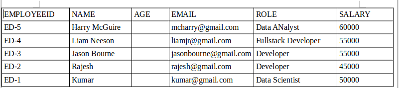
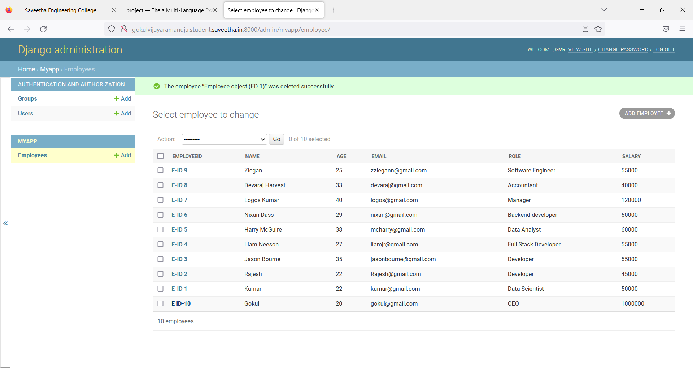

# Django ORM Web Application

## AIM
To develop a Django application to store and retrieve data from a database using Object Relational Mapping(ORM).

## Entity Relationship Diagram

Include your ER diagram here

## DESIGN STEPS

### STEP 1:
Cloning of repository.Setting up of admin and models
### STEP 2:
To make all migrations in the app. Test the server.
### STEP 3:
Include the details in the tables.

Write your own steps

## PROGRAM

Include your code here
#admin.py:
from django.contrib import admin
from .models import Employee,EmployeeAdmin

#Register your models here.
admin.site.register(Employee,EmployeeAdmin)

#models.py:
from django.db import models
from django.contrib import admin

#Create your models here.
class Employee (models.Model):
    employeeid=models.CharField(primary_key=True,max_length=20,help_text="employeeid")
    name=models.CharField(max_length=100)
    age=models.IntegerField()
    email=models.EmailField()
    role=models.CharField(max_length=20)
    salary=models.IntegerField()

class EmployeeAdmin(admin.ModelAdmin):
    list_display=('employeeid','name','age','email','role','salary')

## OUTPUT

## Employee table with 10 records

## Primary key demo

## RESULT
The program for Django ORM App is executed successfully.
